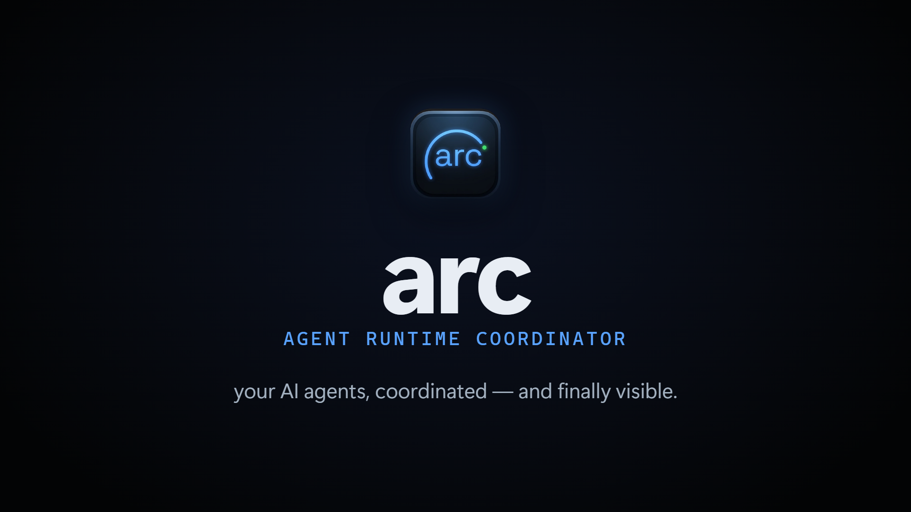

# arc

<p align="center">
  <a href="https://github.com/Veneto723/arc/blob/main/docs/arc-promo.mp4">
    
  </a>
</p>

<p align="center"><em>the Agent Runtime Coordinator — <a href="https://github.com/Veneto723/arc/blob/main/docs/arc-promo.mp4">▶ play the 34-second launch film</a> (sound on)</em></p>

**A Claude-first, native-stdio wrapper for [Claude Code](https://claude.com/claude-code). Windows.**
Three things the built-in CLI can't do:

- **Coordinate** — several sessions in one repo take roles, delegate to each other, and share a board.
- **See** — a live operator view (**arc-scope**) of who's working, who waits on whom, and what's on the roadmap, across every repo.
- **Switch** — change accounts mid-conversation, pick one from a zero-token menu, watch live usage in your statusline.

arc runs `claude` with `stdio: inherit` — claude owns the TTY, so its menus and rendering stay
pixel-perfect (no PTY garble) — and coordinates out-of-band. It hosts one runtime, Claude Code; a
GPT model arrives as an **account** (a proxy), so `/model` swaps provider without the session moving.

---

## Install

```powershell
git clone https://github.com/Veneto723/arc.git
cd arc
powershell -ExecutionPolicy Bypass -File install.ps1
# open a NEW terminal, then:
arc setup    # define your accounts
arc doctor   # verify
arc          # launch
```

Idempotent: deploys the scripts + `/arc-*` skill stubs, adds the `arc` launcher, registers the MCP
server, and **merges** hooks + statusline into `settings.json` (backing it up first). Update later
with `arc update` (pulls the latest release), then `/arc-restart` any live session.

**Requirements:** Windows · Node.js · the `claude` CLI on your PATH.

---

## Coordinate — the board

Point several `arc` sessions at one repo (a *board* = the git root) and they're **peers**. Each
claims a role; a note to a peer lands in its context on its **next turn** — nobody typing anything —
and the statusline shows `📌 N from research` while any wait.

- **Roles** — `/arc-role code` claims a chair; `.arc/roles/<role>.md` states what it `owns:` /
  `send me:` / `not me:`. `arc role` prints the roster: who's here, and what chairs the repo has.
- **Delegate in prose** — say *"get research on this"* and the agent runs
  `arc delegate research "<packet>"`: it leaves a **live** peer a tracked request, **revives** a
  **closed** one *as itself* (with everything it learned), or **forks** this context for a **new**
  one. The agent picks *who* owns the work; arc picks *how* to reach them.
- **Get woken** — an idle role runs `arc join <role>` in the background; it blocks for free until a
  note lands, then **exits** — and that exit re-invokes the agent. The only wake channel there is.
- **"Done" comes from git** — marking a task done diffs the repo against the `HEAD` it recorded at
  the start and posts the note itself, with the commit sha + changed files. Bookkeeping the agent
  can't forget. (Or a `post-commit` hook turns every commit into a note on its own.)

The board (`.arc/peer/`) is **machine-local** — it never enters git; the whole `.arc` (roles
included) travels between machines by `arc export` / `arc import`, never by git. Notes are never
consumed — reading one advances only *your* cursor. The bundled **`peers`** skill teaches the
protocol (when a note is worth leaving, the note kinds, how to ask a peer well).

---

## See — arc-scope + the feed

A role-based board answers *"what's unread for me?"* — but the **human** holds no role, so nothing
served them. arc ships a read-only status **feed** on `127.0.0.1` that answers the missing question:
*what are my agents doing, across every repo?* **arc-scope** is the native desktop companion that
reads it — a docked, always-on-top window showing a live **graph**:

- every session as a node (green = working now, dim = a chair in the roster), azure **edges** for
  who-waits-on-whom and who cooperates, thicker where the bond is stronger;
- the **note flow** (click any note to read it), each session's self-reported activity, and the
  **roadmap**, per repo.

It's a self-contained WPF app built by the C# compiler that ships **inside** Windows — no Rust, no
.NET SDK, nothing to install; one native exe on any Win10/11. arc ships the *feed* (pure Node, in
`src/`); arc-scope is the opt-in *face* (in `scope/`) — build it once with `scope\build.ps1`, then
run `scope\arc-scope.exe`. `arc feed` manages the feed, or open `http://127.0.0.1:8791` for a
built-in browser dashboard.

---

## Commands

All `/arc-*` commands are caught by a hook **before** the model runs — so they cost **zero tokens**
and keep working when an account is rate-limited. Type `/arc` for the autocomplete menu.

| In a session | |
|---|---|
| `/arc-switch [<n\|name>]` | account picker (live usage inline), or switch straight to one |
| `/arc-peek` | usage of **all** accounts (5h/7d + gateway cost/tokens) |
| `/arc-add-account` | add-account **wizard** (Subscription or Gateway) |
| `/arc-role [<name>]` | claim a board role · bare = who am I + the roster |
| `/arc-note <role\|all> <text>` · `/arc-notes` | leave / read board notes |
| `/arc-export` · `/arc-import <archive>` | carry chats (+ the whole `.arc`) between machines |
| `/arc-delete` · `/arc-trash` | delete this conversation → recoverable trash |
| `/arc-restart` · `/arc-help` | reload the wrapper · cheat sheet |

| In a terminal | |
|---|---|
| `arc` · `arc --<id>` · `arc --resume` | launch / on an account / resume (restores model, mode, effort) |
| `arc delegate <role> "<packet>"` · `arc join <role>` | staff a chair · arm the waker (agents call these) |
| `arc status "<text>"` | a session self-reports what it's working on (shown in arc-scope) |
| `arc feed` | ensure the status feed is up (it also auto-starts with any session) |
| `arc add-account` · `arc set-key <id>` · `arc peek` · `arc doctor` | account management + health |

---

<details>
<summary><b>Accounts &amp; configuration</b> — subscriptions, gateways, keys, auto-select</summary>

Everything lives in `~/.claude/arc-config.json` (created by `arc setup`):

```jsonc
{
  "version": 1, "defaultAccount": "max",
  "accounts": [
    { "id": "max", "label": "MAX", "color": "#D97757", "type": "oauth" },   // claude.ai login
    { "id": "mate", "label": "MATE", "color": "#2DD4BF", "type": "api",       // any Anthropic-compatible gateway
      "baseUrl": "https://my-gateway.example.com",
      "apiKeyEnv": "MY_GATEWAY_KEY",          // or "apiKey", "apiKeyFrom": {file,regex}, or "apiKeyEnc" (DPAPI)
      "modelMap": { "opus": "opus", "sonnet": "sonnet", "haiku": "haiku", "fable": "fable" } }
  ],
  "features": { "autoBest": true },
  "spawnProfile": "PowerShell"
}
```

- **`oauth`** — a claude.ai subscription. Each keeps its login in its **own** profile
  (`~/.claude/arc-profiles/<id>/`), so two subscriptions never share credentials; chats/skills are
  junctioned back so switching keeps your conversation. Add with `arc add-account <id>` (browser
  login) or adopt the active login with `arc capture <id>`.
- **`api`** — any gateway. Needs `baseUrl` + a key source; **`apiKeyEnc`** DPAPI-encrypts the key in
  the config (no plaintext, bound to this Windows user+machine — set/rotate with `arc set-key <id>`).
  The add-account flow calls `/v1/models` to verify the key, auto-detect model names, and encrypt
  the key (read from your clipboard, never typed). `--no-verify` / `--model opus=<name>` for odd gateways.
- **Auto-select the best account at launch** (`features.autoBest`, default on) — every `arc` /
  `arc --resume` prefers a subscription with headroom and falls to a gateway only when it's
  exhausted. Cost-aware, launch/resume only, reads the statusline cache (no extra call). `arc doctor`
  prints what it'd pick. `arc --account <id>` overrides once.
- **Gateway usage** — if a gateway serves `<baseUrl>/v1/usage`, arc shows its real cost/tokens in the
  statusline + `/arc-peek` (cached ~5 min, zero model tokens).
- **Manage conversationally (MCP)** — the `arc` MCP server exposes `account_add/remove/update` +
  `config_update`; every write backs up the config, validates first, never echoes secrets.
- **Remove / delete** — `/arc-remove-account` is double-confirmed and never deletes the login file
  (restore from backup). `/arc-delete` moves a conversation to recoverable trash, never a hard delete.

</details>

<details>
<summary><b>Reaching a GPT model</b> — GPT-in-Claude-Code, as an account</summary>

arc hosts one runtime. A GPT model arrives **as an account**: give arc a gateway serving a GPT model,
and Claude Code runs on it — same session, board, hooks, tools; only the model and quota change.
`/arc-add-account` → pick **Codex / GPT**, give the gateway URL + key; arc discovers the GPT models
and maps them onto Claude's tiers, so `/model opus|sonnet|haiku` switches between them.

Claude Code speaks the Anthropic Messages API; a GPT gateway speaks OpenAI — so arc auto-spawns a
tiny local translator (`arc-claudex-proxy`, 127.0.0.1 only) and points the account at it (nothing to
babysit; `arc claudex stop` to control). The key is DPAPI-encrypted and only ever reaches the
translator. **You must already have such a gateway** — arc points at one, it doesn't run one — and
routing subscription credentials through a third-party proxy may breach the provider's ToS: your call.

</details>

<details>
<summary><b>Moving between machines</b> — chats + the whole <code>.arc</code></summary>

Claude Code has no cloud sync. arc ships an explicit **export / import** (no realtime daemon):

```
/arc-export [all|global|<project|id>]   # archive → .tgz  ( --since <days>, --out <f> )
/arc-import <archive.tgz> [E:]          # merge (newer-wins, safe); [E:] re-roots projects under E:\
```

Import backs up anything it overwrites and never touches a conversation open in a live session. The
whole `.arc` (board + roles) also travels this way — it's machine state, never in git. Also
`arc export` / `arc import` from the terminal. **Caveat:** `claude --resume` is scoped to the cwd's
project dir, so both machines must use the **same project paths** for an imported chat to resume.

</details>

<details>
<summary><b>How it works · Troubleshooting</b></summary>

- **Native stdio, not a PTY** — `claude` owns the real terminal; arc coordinates via trigger files,
  never by intercepting keystrokes.
- **Zero-token commands** — a `UserPromptSubmit` hook catches `/arc-<verb>` *before* any model turn,
  so they cost nothing and survive a rate-limit deadlock. The picker is drawn by the wrapper itself
  (raw-mode stdin + ANSI), not the model.
- **Switching** — the hook drops a per-session trigger; the wrapper kills claude and relaunches the
  *same* conversation (`--resume`) on the other account, re-applying model / mode / effort (incl.
  `ultracode`, detected from the transcript). There is no usage-based auto-switch mid-session.
- **Per-conversation lock** — one UUID-pinned conversation per terminal; a lock refuses to open one
  conversation in two live processes (a confirmed crash cause). Every launch/exit is logged.

**Troubleshooting.** `/arc-switch` treated as a normal message → the running wrapper predates a code
change; `/arc-restart` (re-execs from disk; hooks + statusline reload on their own). No toast → toasts
fire for turns ≥ 30s (`ARC_NOTIFY_MIN_MS=0` for every turn). `REFUSING TO LAUNCH — already open` →
that conversation is live in another window. **`arc doctor`** is always the first stop.

</details>

---

## Repo layout

```
src/          wrapper + hooks · account switching · the board (roles/notes/delegate) · the status feed
scope/        arc-scope — the native operator view (C#/WPF, built with the in-box compiler)
mcp/          arc MCP server (account tools)
test/         test suite ( npm test — Windows, incl. a real DPAPI round-trip )
install.ps1   idempotent Windows installer
```

**Windows only** — DPAPI key encryption, WinRT toasts with click-to-focus, and the directory
junctions behind per-account credential isolation all lean on Windows.

## License

[MIT](LICENSE) © 2026 Veneto723
